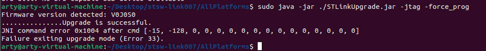
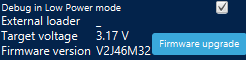

# MILUINO
## Мои страдания (ну не очень) с отечественными мк.
### Акт 1: Обновление прошивки программатора.
Платформой для отладки я избрал плату от АО "НПО КАДЕТЕК" - MILUINO на базе микроконтроллера Миландр MDR1211FI (aka К1986ВЕ92FI).
В качестве программатора-отладчика на ней стоит STlink V2 на базе чипа STM32F103CBT6. Прошивка в нем ожидаемо не актуальная и среды на неё ругаются. Обновить ее стандартными методами не удается (почему я так и не выяснил, возможно в схеме самой платы есть ошибка - утверждать не берусь).
Итак вот алгоритм прошивки прогромматора до актуальной версии (на момент написания - 46) найденный мной:
1. Стереть утилитой STMFlashLoader  Demo через uart (есть на сайте ST). !ВАЖНО! - поставить перемычку в XP9 и uart подключать в XP5 (около USB) (второй uart разъем идет в миландр).
2. Зашить загрузчик той же утилитой (есть на сайте кадетека под этой [статьей](https://cadetech.ru/node/30) (есть еще на гитхабе [NR.electronics](https://github.com/nr-electronics/DiY/tree/master/ST-Link%20V2.1%20%2B%20VCP%20%2B%20Mass%20Storage/Stlink-Bootloaders-master)).
3. Скачать с сайта ST программу stsw-link007.
4. Перейти в директорию AllPlatforms.
5. Запустить STLinkUpgrade.jar из консоли с аргументами [отсюда]( https://github.com/blackmagic-debug/blackmagic/blob/main/src/platforms/stlink/README.md) (в конечном итоге я использовал этот вариант: ```java -jar STLinkUpgrade.jar -msvcp -force_prog```, но работают все для стлинк 2 и 2.1 я проверял)
6. Программа прошьет стлинк и кинет ошибку.
  
   
7. Переподключаем плату - готово прошивка обновлена.

   

### Акт 2: Пробный проект (Blink).
Сборка проекта в IDE Keil не представляет никакой сложности для любого дошедшего до этого шага, и не представляет никакого интереса для меня ибо эта среда мне попросту неудобна. Посему было принято решение перебраться в родной vscode. Для чего у нас есть 2 путя:
1. Keil MDK-6. - 6 версия кейла поставляемая как расширение для vscode.
2. Самосбор на GCC.

Первый путь проще если времени в обрез и надо здесь и сейчас или попросту нет особого желания чуть-чуть поковырятся.
Вся простота первого пути лежит в возможности преобразовывать проекты Keil uvision из 5 в 6 версию с сохранеием обратной совместимости. Достаточно всего лишь скачать расширение ```Arm Keil Studio Pack (MDK v6)``` и выбрать кнопку ```Convert a uVision Project to CMSIS Solution```. Проект откроется среда скачает нужные пакеты, соглашаемся со всем, потом предложат скачать arm-debugger, также соглашаемся - профит. Отладка через встроенный stlink будет работать из коробки.

Путь два. Здесь я в основном опирался на [эту статью с хабра](https://habr.com/ru/articles/788776/?code=4c3cded164ba962ac25673c6004dc7c2&state=oBm2lZB4FiYvIRYNi3WK3ktQ&hl=ru). С той лишь разницей что мной была переделана структура проекта под мои предпочтения, был немного исправлен линковщик (6 строка в оригинале имеет вид ENTRY(Reset_handler); что приводит к warning ```C:/ST/STM32CubeCLT_1.17.0/GNU-tools-for-STM32/bin/../lib/gcc/arm-none-eabi/12.3.1/../../../../arm-none-eabi/bin/ld.exe: warning: cannot find entry symbol Reset_handler; defaulting to 080000c0```, решением служит замена буквы h на H (ENTRY(Reset_handler);-> ENTRY(Reset_Handler);) причина лежит в том что в в ассемблерном файле символ объявлен именно как Reset_Handler) и произведен переход от отладки через jlink к отладке через встроенный stlink с помощью openocd. Проект-шаблон представлен в репозитории. Директория .vscode с файлами launch и tasks прикреплена также.
